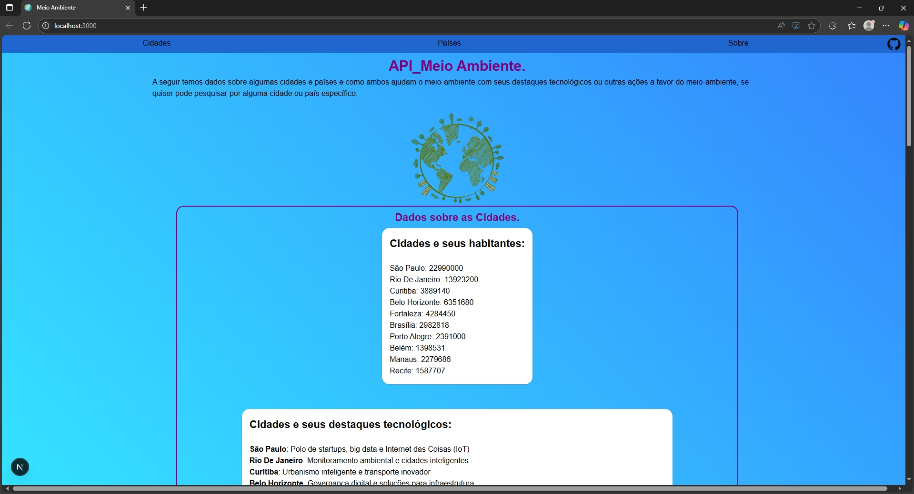
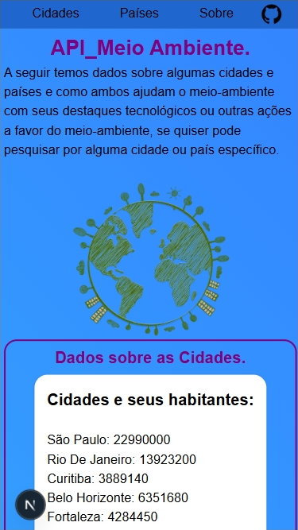

# 🌱Meio Ambiente

O site meio ambiente é um projeto desenvolvido durante o mini projeto do Módulo 5 do curso de Desenvolvedor WEB Fullstack da PDA.

## 🎯Objetivo

O objetivo principal era cada aluno utilizar a API desenvolvida por si próprio durante o mini projeto do Módulo 4 do mesmo curso, fazendo assim um site que receba dados dessa API.

**🔗Repositório da API no Github:** [API - MeioAmbiente](https://github.com/alissonn17/apiMeioambiente)

## 🖼️ Screenshots

Site no navegador do PC




Responsivo sendo usado no mobile



## ⚙️Next

Este é um projeto [Next.js](https://nextjs.org) inicializado com [`create-next-app`](https://nextjs.org/docs/app/api-reference/cli/create-next-app).

### 🏃‍♂️Rodar o projeto

Primeiro, baixe todas as dependências:

```bash
npm i
```

Agora execute o servidor de desenvolvimento: 

```bash 
npm run dev 
# ou 
yarn dev 
# ou 
pnpm dev 
# ou 
bun dev 
``` 

Abra [http://localhost:3000](http://localhost:3000) no seu navegador para ver o resultado.

### 📚Saiba Mais do Next

Para saber mais sobre o Next.js, consulte os seguintes recursos: 

- [Documentação do Next.js](https://nextjs.org/docs) - saiba mais sobre os recursos e a API do Next.js. 

- [Aprenda Next.js](https://nextjs.org/learn) - um tutorial interativo do Next.js.

## 📘Sobre
### 🏷️ Tópicos

- **Sustentabilidade Ambiental** ♻️  
  Mapeamento de ações ecológicas implementadas por cidades e nações.

- **Integração com APIs** 🔗  
  Consulta a fontes externas para coleta de dados atualizados sobre iniciativas verdes.

- **Geolocalização e Dados Globais** 🌍  
  Identificação de regiões e comparação entre políticas ambientais ao redor do mundo.


## 📦 Dependências

| Pacote       | Versão   |
|--------------|----------|
| next         | 15.3.3   |
| react        | ^19.0.0  |
| react-dom    | ^19.0.0  |

## 🛠️ Dependências de Desenvolvimento

| Pacote                 | Versão   |
|------------------------|----------|
| typescript             | ^5       |
| @types/node            | ^20      |
| @types/react           | ^19      |
| @types/react-dom       | ^19      |
| tailwindcss            | ^4       |
| @tailwindcss/postcss   | ^4       |
| eslint                 | ^9       |
| eslint-config-next     | 15.3.3   |
| @eslint/eslintrc       | ^3       |


🚀 Requisitos

- Node.js 20+
- NPM ou Yarn